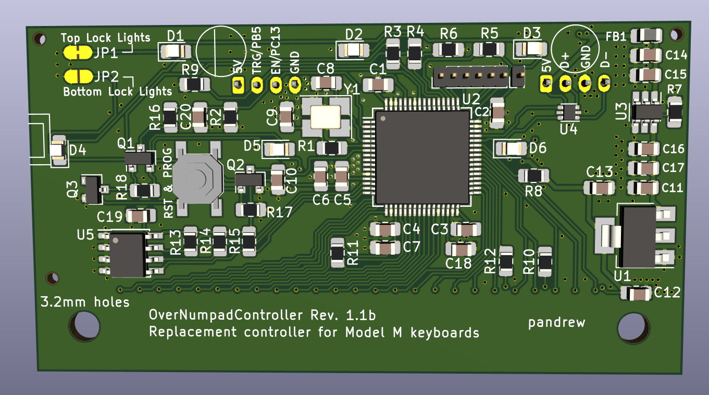
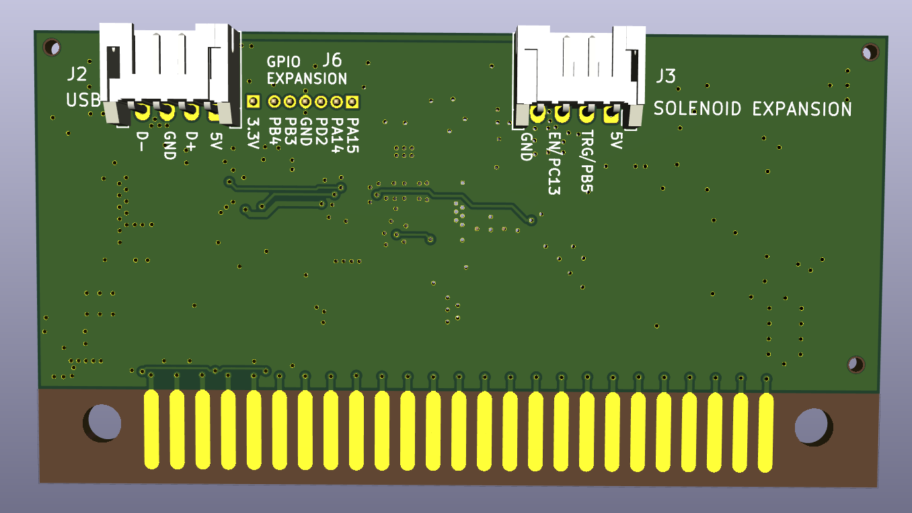

# OverNumpad Controller

This is a replacement keyboard controller, for 4th generation IBM/Lexmark
Model M keyboards, and Unicomp keyboards that use the same mounting style
over the numpad.

Licensed under CERN-OHL-P v2 or later

## Images

## Keyboards supported

Only some of the listed supported keyboards has been tested at the time of release.
Some keyboards may require additional software work for support.
This list may change in the future.

* IBM/Lexmark 4th generation Model M keyboards
  See [here](https://deskthority.net/wiki/IBM_Enhanced_Keyboard) for more detail on IBM Model M keyboard generations.
  The easiest way to identify IBM/Lexmark keyboards supported by this controller is to look at the lock lights led alignment.
  Top-aligned leds means that the controller is located over the numpad, and may be replaced by this controller.
  However this controller also provides a solder jumper option, for a set of leds that are compatible with bottom-aligned
  locklight stickers.

* Various Unicomp keyboards, that use the same mounting mechanism, including:
  * Spacesaver M keyboards
  * Ultra Classic keyboards
  * Classic keyboards
  * New Model M keyboards
  * PC122 keyboards
  * The following exceptions apply:
    * The Mini M uses a bottom-mounted controller, therefore it's not supported
    * This controller may be used on keyboards that include additional input devices, such as trackballs, and pointing sticks,
      and card readers, but the controller will not support the additional devices.

## Two versions are available
The mounting holes on the controller can come in two variants:
### 3.2mm mounting holes version
* Used by IBM/Lexmark 4th generation Model M keyboards
* Used by some Unicomp keyboards, generally the older, the more likely that it uses a small-hole controller
* The small-hole variant will not fit on keyboards that use big-hole controllers
### 4.3mm mounting holes version
* Used by some Unicomp keyboards, generally the newer, the more likely that it uses a big-hole controller
* The big-hole controller will not be securely held in place, and will likely not work correctly if it is mounted on a keyboard with a small-hole controller.

## How to order from JLCPCB:
1. Go to http://jlcpcb.com , sign in to your account (create one if you don't have one)
2. Click Order Now
3. Upload the .zip file from the "order" subfolder. Make sure to select the correct version.
4. Select PCB Qty you wish to build
5. Set "Remove Order Number" to "Specify a location"
6. Scroll down, turn on the "SMT Assembly" option
7. Select "Assemble top side"
8. Select "Tooling holes" = "Added by Customer"
9. Click "I agree to the Terms and Conditions..."
10. Click "Next" on the right side
11. Click "Add BOM File", upload the "*_bom_jlc.csv" file from the "order" subfolder.
12. Click "Add CPL File", upload the "*_cpl_jlc.csv" file from the "order" subfolder.
13. Click "Next"
14. Make sure that all parts say "Confirmed" with a little check box in the final column. If it shows a greyed out "confirm", or a yellow "Inventory shortage", or there is a red "No parts selected" in the Matched Part Detail column, then some parts may be out of stock. (If parts are out of stock then your options are Wait until it's back in stock / Find equivalent replacement with correct footprint, if it is in the JLCPCB parts library / Redesign the board with a different component / Order the missing part from another supplier and solder it yourself )
15. Click "Next"
16. Double-check components look correctly rotated (this is expected to be correct unless JLCPCB makes changes to their system)
17. Double-check again, that Selected Parts has the correct number of items (21 items for v1.1b), and that Unselected Parts has 0 items.
18. Save to Cart, Check Out.

## Components of this design that have to be ordered separately:
The connectors for the USB cable, and for the solenoid driver need to be ordered separately. Compatible connectors are available from a variety of manufacturers, and distributors, one example:
* Through-hole male connector: https://www.tme.eu/en/details/ds1066-4mrw6sa/raster-signal-connectors-2-00mm/connfly/
* Female connector (for USB cable, or for ribbon cable): https://www.tme.eu/en/details/i-ds1066-scw04/raster-signal-connectors-2-00mm/connfly/
* Crimp pins for the female connector: https://www.tme.eu/en/details/t-ds1066-sc600/raster-signal-connectors-2-00mm/connfly/
